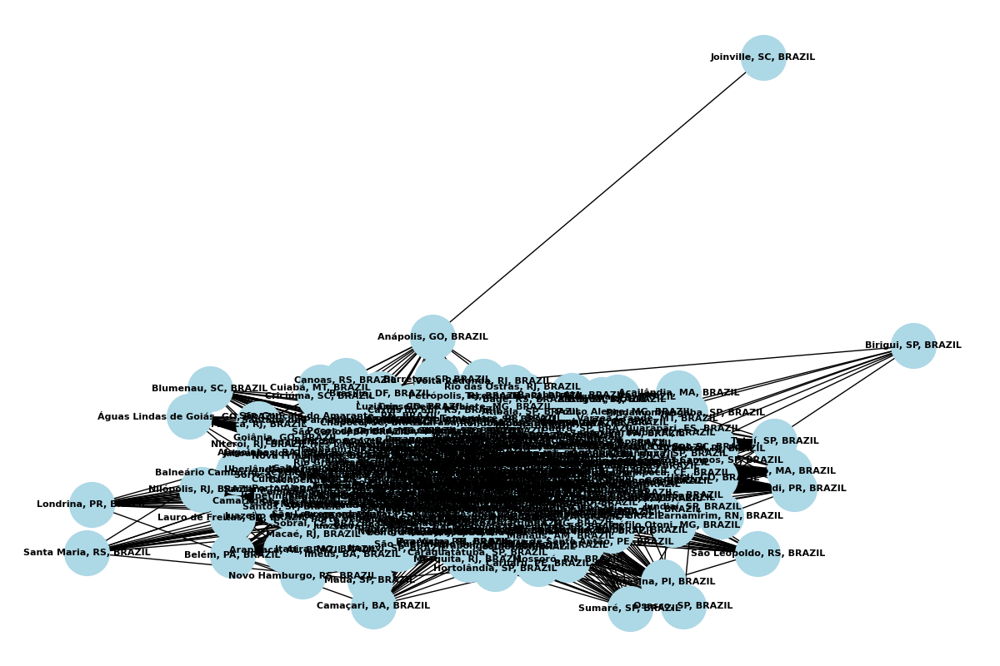
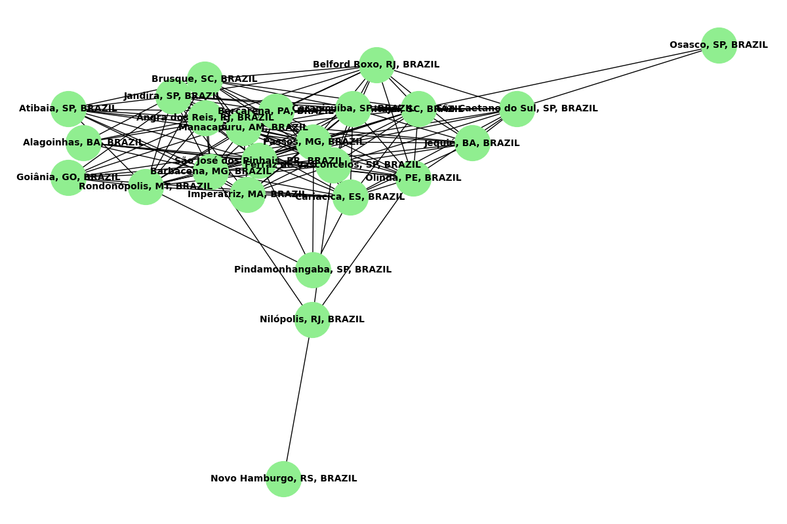
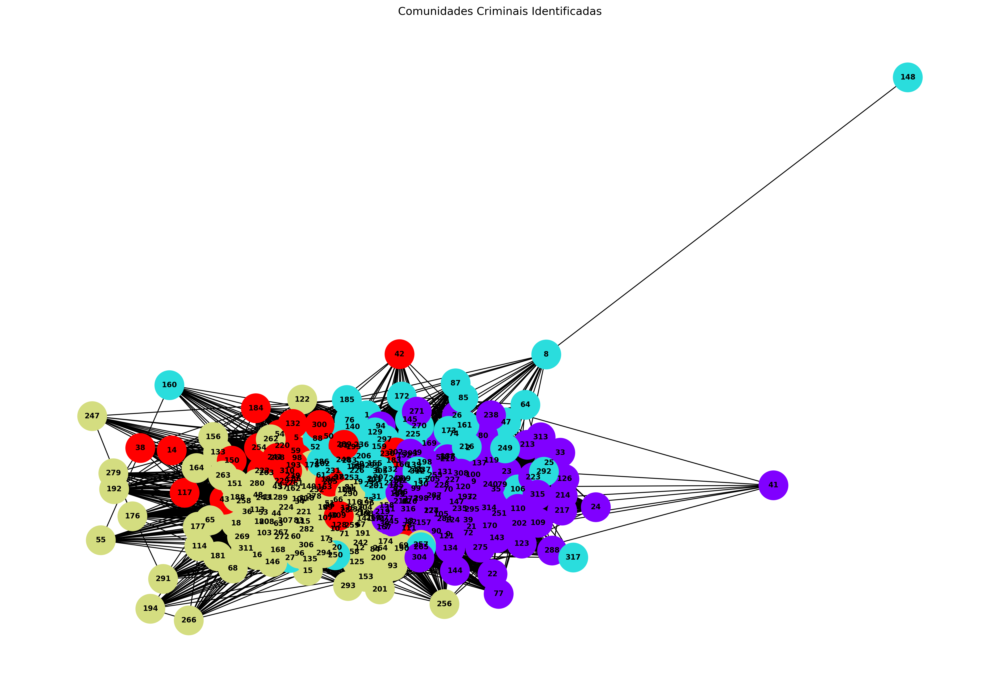
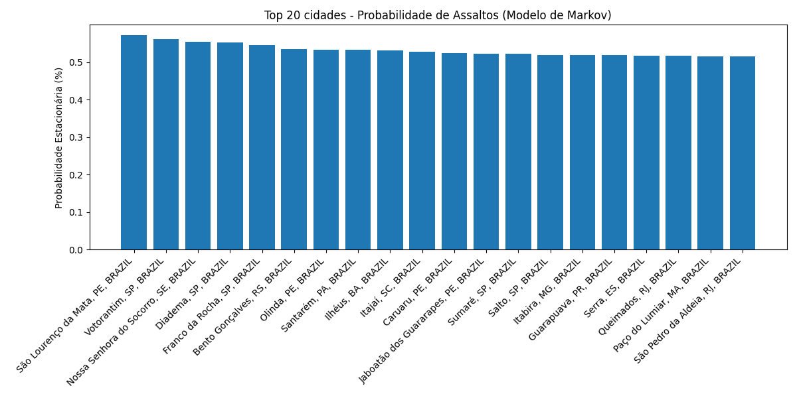

# Modeling Criminal Occurrences with Graphs and Markov Chains

This project analyzes criminal occurrences in Brazilian cities using semantic graphs and Markov chains. It provides insights into crime patterns and relationships between different cities based on crime descriptions.

## Project Structure

The project consists of three main components:

### 1. Semantic Graph Construction (`build_semantic_graph.py`)
- Creates a semantic graph connecting cities based on similar crime patterns
- Uses sentence transformers to generate embeddings from crime descriptions
- Produces visualizations of the semantic relationships between cities




### 2. Community Analysis (`community_analysis.py`)
- Detects communities within the semantic graph using the Louvain method
- Analyzes crime patterns within each community
- Categorizes crimes into different types (drug-related, armed violence, etc.)



### 3. Markov Chain Analysis (`markov_analysis.py`)
- Implements a Markov chain model to analyze crime patterns
- Calculates stationary probabilities for cities
- Simulates crime propagation paths



## Setup and Installation

1. Clone the repository:
```bash
git clone https://github.com/yourusername/Modeling-Criminal-Occurrences-with-Graphs-and-Markov-Chains.git
cd Modeling-Criminal-Occurrences-with-Graphs-and-Markov-Chains
```

2. Install required dependencies:
```bash
pip install -r requirements.txt
```

## Usage

1. First, run the semantic graph construction:
```bash
python build_semantic_graph.py
```

2. Then, perform community analysis:
```bash
python community_analysis.py
```

3. Finally, run the Markov chain analysis:
```bash
python markov_analysis.py
```

## Results

The analysis results are stored in three directories:
- `results-graph/`: Contains semantic graph visualizations and matrices
- `results-comunity/`: Contains community analysis results
- `results-markov/`: Contains Markov chain analysis results

## Dependencies

The project requires Python 3.x and the following main packages:
- pandas
- numpy
- networkx
- matplotlib
- sentence-transformers
- scikit-learn
- python-louvain

All dependencies are listed in `requirements.txt`.
